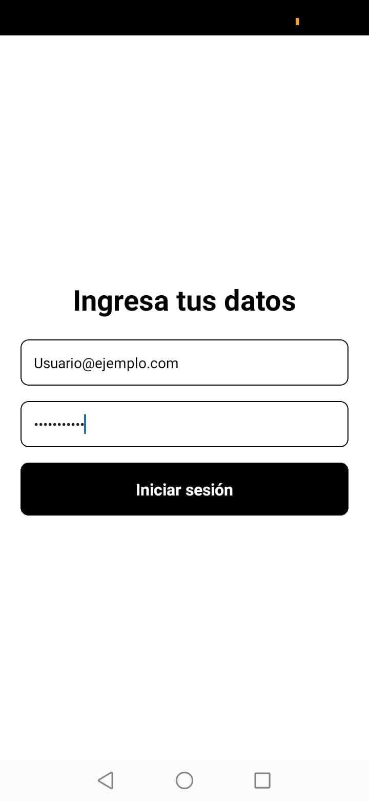
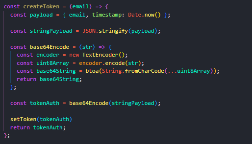
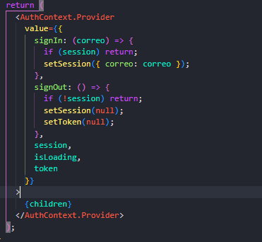

# myAuth

## Introducción 
En este repositorio se encuentra el código a mi aplicación "myAuth" que consta de las siguientes funciones:
1. Inicio de sesión
2. Autenticación por correo
-- Las credenciales son:
usuario@ejemplo.com
password123
3. Generación de token

## Plantillas
### Inicio de sesión
A continuación, se muestra una captura del inicio de sesión

Este inicio de sesión tiene la funcionalidad de convertir en minúsculas las credenciales, en caso de que el dispositivo convierta en mayúsculas por defecto los primeros carácteres. 

### Seguridad
En esta captura, se muestra la función para crear el token. Esta función permite encriptar el token por una serie de llaves, considerando al email que se pasa como argumento y el tiempo que se creó la sesión.

### Lógica de inicio de sesión
Se muestra la lógica de inicio de sesión que recibe las credenciales del usuario.

